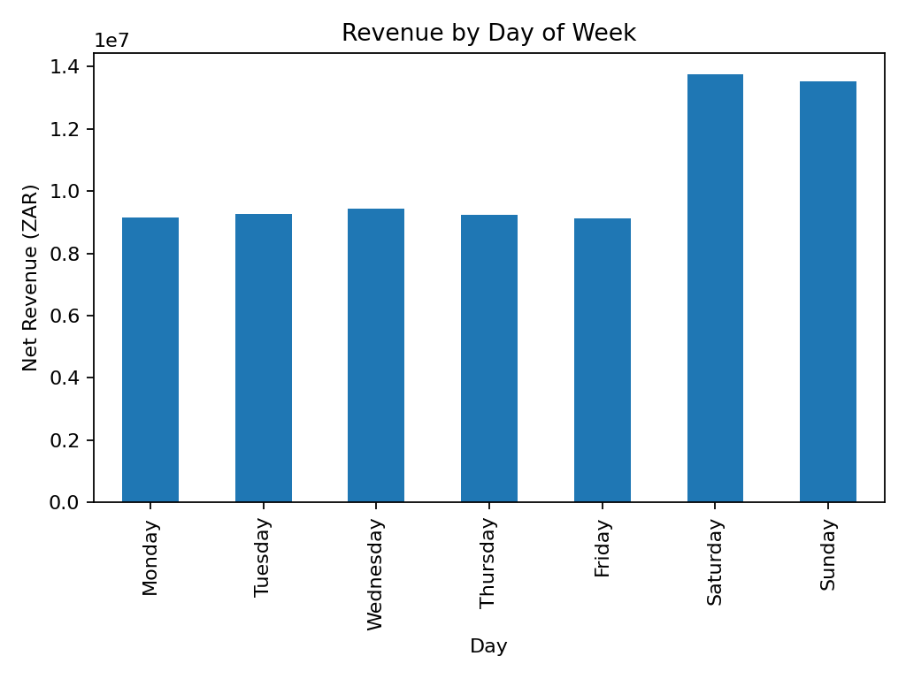
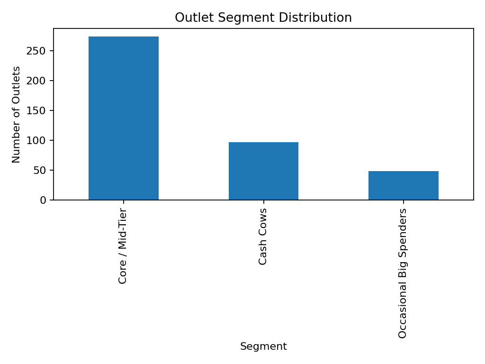
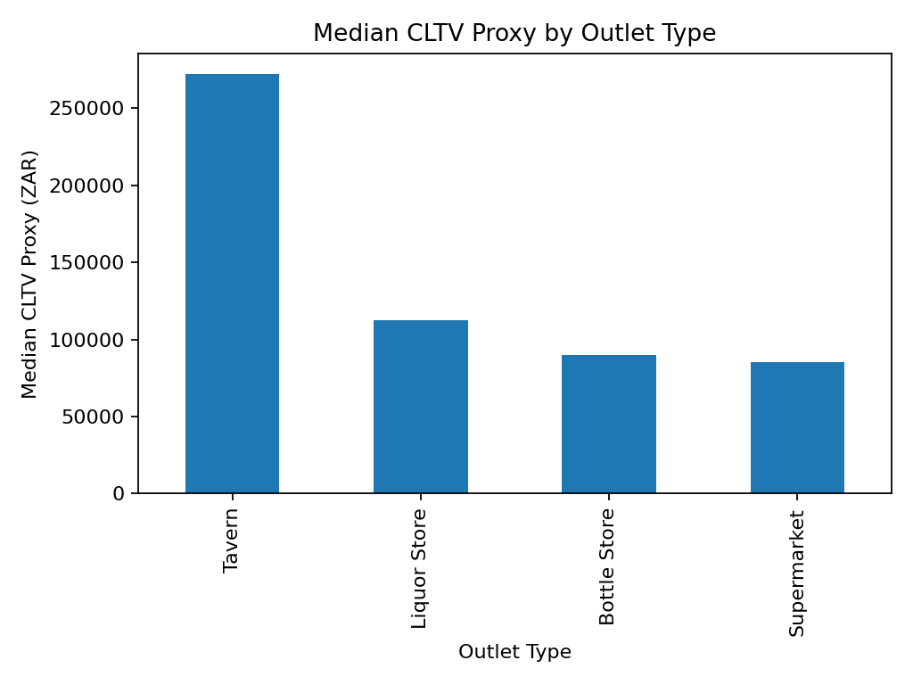

# Alcohol Retail & Tavern Performance Intelligence (Purchase Frequency + CLTV)

## Executive summary

- **Total net revenue (synthetic 2025):** ZAR 73,462,534

- **Weekend share of revenue:** 37.1% (captures the *weekend economy*)

- **Top-value outlets:** a small subset of outlets dominate CLTV proxy; segmenting them makes account prioritisation easy.

## Key charts

## Segmentation logic (simple + defensible)

- **Cash Cows:** high revenue and high purchase frequency

- **Weekend Economy:** high frequency with strong weekend dependency

- **Occasional Big Spenders:** lower frequency but high average order value

- **At-Risk / Low Activity:** low activity and shorter observed lifespan

- **Core / Mid-Tier:** stable middle

## Top 10 outlets by CLTV proxy

| outlet_id   | outlet_type   | province      | city         | wholesaler_region   |   revenue |   tickets_per_month |   avg_aov |   cltv_proxy | segment   |
|:------------|:--------------|:--------------|:-------------|:--------------------|----------:|--------------------:|----------:|-------------:|:----------|
| O0154       | Tavern        | Free State    | Bloemfontein | Coastal Hub         |    314316 |            103.5    |   252.395 |       313475 | Cash Cows |
| O0417       | Tavern        | Limpopo       | Polokwane    | South Hub           |    308401 |            100.333  |   256.413 |       308721 | Cash Cows |
| O0274       | Tavern        | Free State    | Bloemfontein | North Hub           |    308140 |            101.583  |   252.636 |       307963 | Cash Cows |
| O0283       | Tavern        | KwaZulu-Natal | Durban       | North Hub           |    306579 |             99.1667 |   258.275 |       307347 | Cash Cows |
| O0016       | Tavern        | Free State    | Bloemfontein | South Hub           |    308298 |             99.0833 |   258.11  |       306893 | Cash Cows |
| O0028       | Tavern        | Limpopo       | Polokwane    | Coastal Hub         |    307218 |            103.417  |   246.846 |       306335 | Cash Cows |
| O0324       | Tavern        | Limpopo       | Polokwane    | Coastal Hub         |    304998 |            101.75   |   249.879 |       305102 | Cash Cows |
| O0070       | Tavern        | Gauteng       | Tembisa      | South Hub           |    303343 |             98.8333 |   257.108 |       304930 | Cash Cows |
| O0289       | Tavern        | KwaZulu-Natal | Umlazi       | Coastal Hub         |    304134 |            100.417  |   252.941 |       304794 | Cash Cows |
| O0208       | Tavern        | Limpopo       | Polokwane    | North Hub           |    301178 |            101.333  |   249.436 |       303314 | Cash Cows |

